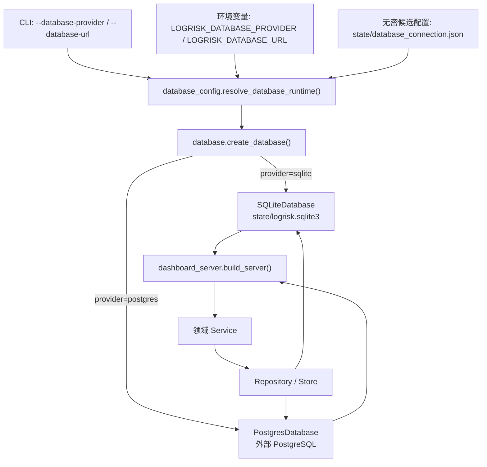
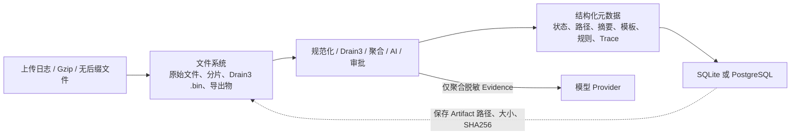

# 数据库调用关系

本文说明 LOGRISK 在 SQLite/PostgreSQL 双模式下，从配置解析、建表迁移、领域读写到 Dashboard API 的数据库调用关系。项目不使用 ORM，表结构由 SQL migration 管理，业务代码通过统一 `Database` 接口执行参数化 SQL。

## 四层结构与权威来源

| 层级 | 位置 | 职责 |
|---|---|---|
| 字段数据字典 | `database/schema.yaml` | 说明表用途、字段含义、主外键、索引和 PostgreSQL 类型映射 |
| 真实建表结构 | `database/migrations/`、`database/postgres/migrations/` | 分别定义 SQLite 与 PostgreSQL 的表、字段、约束和索引 |
| 领域数据访问 | `src/logrisk/` 下的 Repository、Store | 执行 `SELECT`、`INSERT`、`UPDATE` 和事务 |
| 运行时装配 | `src/pipeline/dashboard_server.py` | 选择数据库 Provider，并把同一数据库对象注入各领域服务 |

当数据字典与迁移文件不一致时，以已经应用的 migration SQL 为真实数据库结构；`schema.yaml` 必须同步修正。已经执行的 migration 不允许修改，校验摘要记录在 `schema_migrations`。

## Provider 选择与调用链



配置优先级为 CLI、环境变量、候选配置、SQLite 默认值。PostgreSQL 必须显式选择且提供连接地址；连接失败时服务启动失败，不会自动回退到 SQLite，也不会双写。

`Database` 对外提供 `connect()` 和 `transaction()`。业务代码统一使用 `?` 参数占位符；`PostgresDatabase` 在适配层转换为 `%s`，同时处理 JSONB、UTC 时间和 PostgreSQL 返回行。因此部分历史类仍以 `SQLite*Store` 命名，但接收的是统一数据库对象，在 PostgreSQL 模式下实际读写 PostgreSQL。

## 数据库与文件系统边界



PostgreSQL 模式下，所有结构化运行时业务状态统一写入 PostgreSQL。以下内容仍保存在文件系统：

- 上传文件、上传分片和大文件处理中间文件；
- Drain3 `.bin` 状态；
- 导出的 JSON 产物；
- 仓库中的 Prompt、模型 Profile、Drain3 和语义规则种子；
- 不含密码的 PostgreSQL 候选连接配置；
- Artifact 文件本体。数据库只保存路径、类型、大小和摘要。

原始日志、API Key、Token、密码和含密 DSN 不得进入业务表、AI Trace、Observation 或 Replay。

## 69 张表与代码映射

当前逻辑结构共 69 张表：68 张由版本化 migration 创建，`schema_migrations` 由数据库适配层创建。

### 管理与迁移（3）

| 表 | 用途 | 主要代码 |
|---|---|---|
| `schema_migrations` | migration 版本与 SHA256 | `src/logrisk/database.py` |
| `legacy_imports` | 旧 JSON/JSONL 文件幂等导入账本 | `src/logrisk/legacy_import.py` |
| `app_settings` | 默认 Profile、活动配置等全局设置 | `src/logrisk/ai_harness/model_profile.py`、`src/logrisk/sqlite_stores.py` |

### 模型连接与 Prompt（4）

| 表 | 用途 | 主要代码 |
|---|---|---|
| `provider_connections` | Ollama、OpenAI-compatible、扩展 Provider 连接 | `src/logrisk/ai_harness/connections.py` |
| `model_profiles` | 模型、连接、预算、Thinking、输出模式和可选单价 | `src/logrisk/ai_harness/model_profile.py` |
| `prompt_templates` | Prompt 元数据和当前版本指针 | `src/logrisk/ai_harness/prompt_registry.py` |
| `prompt_versions` | 不可变 Prompt 内容版本 | `src/logrisk/ai_harness/prompt_registry.py` |

### 特征任务（4）

| 表 | 用途 | 主要代码 |
|---|---|---|
| `feature_jobs` | 特征任务配置和整体状态 | `src/logrisk/sqlite_stores.py` |
| `feature_job_entities` | 风险实体处理、重试和规则复用状态 | `src/logrisk/sqlite_stores.py` |
| `feature_candidates` | 模型或规则产生的候选特征与审批状态 | `src/logrisk/sqlite_stores.py` |
| `feature_job_events` | 任务追加式事件流 | `src/logrisk/sqlite_stores.py` |

### 规则治理（5）

| 表 | 用途 | 主要代码 |
|---|---|---|
| `approved_rules` | 当前批准规则资产 | `src/logrisk/rule_governance.py`、`src/logrisk/sqlite_stores.py` |
| `rule_versions` | 规则不可变版本 | `src/logrisk/rule_governance.py` |
| `rule_feedback` | 有效命中和误报反馈 | `src/logrisk/rule_governance.py` |
| `rule_audit_events` | 状态变更、回滚和审批审计 | `src/logrisk/rule_governance.py` |
| `rule_reuse_events` | 规则复用命中记录 | `src/logrisk/rule_governance.py`、`src/logrisk/sqlite_stores.py` |

### AI Trace、观测、Replay 与 Cache（7）

| 表 | 用途 | 主要代码 |
|---|---|---|
| `ai_traces` | 脱敏模型调用快照 | `src/logrisk/sqlite_stores.py` |
| `observability_runs` | 一次端到端分析的 Observation | `src/logrisk/observability.py` |
| `observability_spans` | 各处理阶段 Span | `src/logrisk/observability.py` |
| `replay_runs` | 历史校验或原模型 Replay | `src/logrisk/observability.py` |
| `replay_events` | Replay 追加式事件 | `src/logrisk/observability.py` |
| `ai_cache_entries` | Evidence、Prompt、模型组合缓存 | `src/logrisk/sqlite_stores.py` |
| `processing_metrics_daily` | 每日模型关联日志量 | `src/logrisk/sqlite_stores.py` |

### 上传、流式处理与 Artifact（7）

| 表 | 用途 | 主要代码 |
|---|---|---|
| `upload_sessions` | 分片上传会话及文件摘要 | `src/logrisk/sqlite_stores.py` |
| `input_jobs` | 大文件预处理任务、进度和聚合结果 | `src/logrisk/sqlite_stores.py` |
| `streaming_tasks` | 增量来源和 Checkpoint 状态 | `src/logrisk/streaming_state.py` |
| `streaming_window_commits` | 已提交窗口幂等记录 | `src/logrisk/streaming_state.py` |
| `unknown_template_queue` | 未知脱敏模板治理队列 | `src/logrisk/streaming_state.py` |
| `streaming_task_events` | 流式任务审计事件 | `src/logrisk/streaming_state.py` |
| `artifacts` | 文件产物路径、大小和校验值 | `src/logrisk/sqlite_stores.py` |

### 生产运行（4）

| 表 | 用途 | 主要代码 |
|---|---|---|
| `runtime_policies` | Retention 策略和乐观版本 | `src/logrisk/runtime/repository.py`、`src/logrisk/runtime/service.py` |
| `runtime_maintenance_runs` | Retention 预览与执行记录 | `src/logrisk/runtime/repository.py`、`src/logrisk/runtime/service.py` |
| `runtime_quota_snapshots` | 接受上传或分析前的最新存储用量快照 | `src/logrisk/runtime/repository.py`、`src/logrisk/runtime/service.py` |
| `runtime_audit_events` | PACAS/RBAC 身份上下文下的脱敏运行审计 | `src/logrisk/runtime/repository.py`、`src/pipeline/dashboard_server.py` |

### 多来源智能关联（5）

| 表 | 用途 | 主要代码 |
|---|---|---|
| `multi_source_rules` | 确定性来源组合和阈值规则 | `src/logrisk/multi_source/repository.py`、`src/logrisk/multi_source/service.py` |
| `multi_source_observations` | 聚合模板窗口形成的脱敏实体观察 | `src/logrisk/multi_source/service.py`、`src/logrisk/multi_source/repository.py` |
| `multi_source_correlations` | 跨来源证据链头信息 | `src/logrisk/multi_source/correlation.py`、`src/logrisk/multi_source/repository.py` |
| `multi_source_correlation_items` | 证据链与观察的有序成员关系 | `src/logrisk/multi_source/repository.py` |
| `multi_source_audit_events` | 关联规则修改审计 | `src/logrisk/multi_source/repository.py`、`src/pipeline/dashboard_server.py` |

### Drain3 治理（10）

| 表 | 用途 | 主要代码 |
|---|---|---|
| `drain_templates` | 当前 Drain3 模板资产 | `src/logrisk/sqlite_stores.py` |
| `drain_template_versions` | 模板编辑、合并和回滚版本 | `src/logrisk/sqlite_stores.py` |
| `drain_template_events` | 模板治理审计 | `src/logrisk/sqlite_stores.py` |
| `drain_config_versions` | Drain3 INI 参数和脱敏规则版本 | `src/logrisk/sqlite_stores.py` |
| `drain_config_events` | 配置发布与回滚审计 | `src/logrisk/sqlite_stores.py` |
| `drain_datasets` | Gold Dataset 元数据 | `src/logrisk/sqlite_stores.py` |
| `drain_annotations` | 模板标注 | `src/logrisk/sqlite_stores.py` |
| `drain_reviews` | 可疑模板人工处理记录 | `src/logrisk/sqlite_stores.py` |
| `drain_eval_runs` | Drain3 质量评测任务 | `src/logrisk/sqlite_stores.py` |
| `drain_tune_runs` | 参数调优任务 | `src/logrisk/sqlite_stores.py` |

### 语义词典（4）

| 表 | 用途 | 主要代码 |
|---|---|---|
| `semantic_dictionaries` | 词典元数据和活动版本 | `src/logrisk/sqlite_stores.py` |
| `semantic_dictionary_versions` | 词典规则版本 | `src/logrisk/sqlite_stores.py` |
| `semantic_validation_runs` | 词典校验报告 | `src/logrisk/sqlite_stores.py` |
| `semantic_events` | 发布、回滚和编辑审计 | `src/logrisk/sqlite_stores.py` |

### 风险语义（5）

| 表 | 用途 | 主要代码 |
|---|---|---|
| `risk_semantic_rules` | 当前确定性风险语义规则 | `src/logrisk/risk_semantics.py` |
| `risk_semantic_rule_versions` | 风险规则不可变版本 | `src/logrisk/risk_semantics.py` |
| `risk_semantic_events` | 风险规则治理审计 | `src/logrisk/risk_semantics.py` |
| `risk_semantic_validations` | 正负样例校验报告 | `src/logrisk/risk_semantics.py` |
| `risk_semantic_unclassified` | 未分类风险模式队列 | `src/logrisk/risk_semantics.py` |

### 节点风险（5）

| 表 | 用途 | 主要代码 |
|---|---|---|
| `node_risk_events` | 节点风险事件 | `src/logrisk/node_risk.py` |
| `node_risk_ingestions` | 来源事件幂等写入账本 | `src/logrisk/node_risk.py` |
| `node_risk_daily` | 节点风险日聚合 | `src/logrisk/node_risk.py` |
| `node_risk_snapshots` | 当前节点综合风险快照 | `src/logrisk/node_risk.py` |
| `node_risk_audit_events` | 人工确认和恢复审计 | `src/logrisk/node_risk.py` |

### Benchmark（6）

| 表 | 用途 | 主要代码 |
|---|---|---|
| `benchmark_suites` | Benchmark Case 集合 | `src/logrisk/benchmark_center/repository.py` |
| `benchmark_runs` | 执行配置、状态和聚合指标 | `src/logrisk/benchmark_center/repository.py` |
| `benchmark_case_results` | 单 Case 质量结果 | `src/logrisk/benchmark_center/repository.py` |
| `benchmark_gates` | 基线与候选门禁决策 | `src/logrisk/benchmark_center/repository.py` |
| `benchmark_artifacts` | Benchmark 产物元数据 | `src/logrisk/benchmark_center/repository.py` |
| `benchmark_audit_events` | Benchmark 追加式审计 | `src/logrisk/benchmark_center/repository.py` |

## 典型调用示例

### AI Trace

```text
feature_extractor_ollama._write_trace()
  → SQLiteAITraceLogger.append()
  → INSERT ... ON CONFLICT INTO ai_traces
  → Database.transaction()
  → SQLiteDatabase 或 PostgresDatabase
```

类名 `SQLiteAITraceLogger` 是历史命名。它不再写 `ai_traces.jsonl`，实际通过注入的数据库对象写入 `ai_traces`。

### Feature Job

```text
Dashboard POST /api/jobs
  → FeatureJobManager.create_job()
  → SQLiteFeatureJobStore.save()
  → feature_jobs
  → feature_job_entities
  → feature_candidates
  → feature_job_events
```

任务、实体、候选和事件在同一个运行数据库中保存；审批后，批准规则再由规则 Store 和治理 Repository 写入规则相关表。

### Observation、Span 与 Replay

```text
FeatureJobManager._emit_locked()
  → SpanRecorder
  → ObservabilityRepository
  → observability_runs / observability_spans

POST /api/observability-v2/replays
  → ReplayService
  → replay_runs / replay_events
```

Span 写入失败不会中断主分析流程。Replay 使用锁定的脱敏 Evidence、Prompt、Profile 和 Provider 快照，结果不会写入候选特征或批准规则。

### Production Runtime

```text
Dashboard POST/PUT/PATCH/DELETE
  → RequestIdentity（仅可信 PACAS/RBAC 代理 Header）
  → RuntimeService.require_capacity() / Retention 操作
  → RuntimeRepository
  → runtime_policies / runtime_maintenance_runs
  → runtime_quota_snapshots / runtime_audit_events
```

运行中心读取现有 `feature_jobs`、`input_jobs`、`streaming_tasks`、`benchmark_runs` 和 `replay_runs`，不会复制任务记录。Retention 只读取 `artifacts` 的元数据；文件本体仍位于文件系统，删除前会校验受控根目录、年龄、任务状态和受保护 Artifact 类型。`runtime_audit_events` 仅记录方法、路径、状态、外部主体、角色和请求 ID 等脱敏元数据。

### PostgreSQL 复用 Store

```text
resolve_database_runtime()
  → create_database(provider="postgres")
  → PostgresDatabase
  → dashboard_server 将该对象注入 SQLiteFeatureJobStore 等历史命名类
  → PostgresDatabase 转换占位符、JSON 和返回行
  → PostgreSQL
```

数据库选择发生在 Store 创建之前，因此业务代码不需要分别维护 SQLite SQL 和 PostgreSQL SQL；两端差异集中在 migration 和数据库适配层。

### 多来源实体与时间线

```text
Normalizer → Entity Router → Drain3（仅处理 message_core）
  → TemplateEventAggregator（透传 entity_keys / entity_relations）
  → Risk Engine
  → MultiSourceService
  → multi_source_observations
  → Correlation Engine
  → multi_source_correlations / multi_source_correlation_items
```

实体路由只使用日志元数据中的明确标识、配置别名和容器—Pod—命名空间—节点等显式关系。不同集群永不关联；缺少可靠标识时记录为不可路由。数据库只保存 Drain3 脱敏模板、计数、风险、实体和时间，不保存 `samples`、`raw_sample`、`message_core` 或原始日志。

## 如何定位字段调用

以 `ai_traces.prompt_hash` 为例：

1. 在 `database/schema.yaml` 查看字段用途；
2. 在两个 migration 目录确认字段类型、索引和约束；
3. 在 `src/` 搜索表名或字段名，定位实际 SQL；
4. 沿调用方回溯到 Service、Feature Job 或 Dashboard API。

常用命令：

```bash
# 查字段说明和建表语句
rg -n "prompt_hash" database/schema.yaml database/migrations database/postgres/migrations

# 查业务代码中的字段读写
rg -n "prompt_hash|ai_traces" src

# 查某张表的全部 SQL
rg -n "INSERT INTO ai_traces|UPDATE ai_traces|FROM ai_traces" src

# 查看 SQLite 当前已应用的 migration
sqlite3 state/logrisk.sqlite3 \
  "SELECT version, name, applied_at FROM schema_migrations ORDER BY version;"

# 查看 SQLite 当前业务表
sqlite3 state/logrisk.sqlite3 \
  "SELECT name FROM sqlite_master WHERE type='table' AND name NOT LIKE 'sqlite_%' ORDER BY name;"
```

排查字段时不要只搜索前端 API 字段。部分 API 字段来自 `*_json` 快照，并不是独立数据库列；应继续检查 Repository 中的 JSON 序列化和反序列化逻辑。
